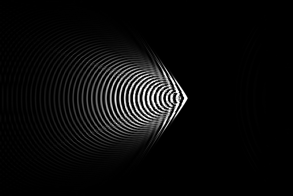

# Ondulatória
O efeito Doppler pode ser explicitado por essa simulação feita no processing. Além disso, quando a fonte de emissão atinge velocidade suficientemente alta é possível visualizar o cone de Mach.

## 1. Efeito Doppler
Devido ao efeito Doppler, a frequência percebida por um observador será diferente, haja vista a variação do comprimento de onda aparente. Note na imagem que as frentes de onda no lado direito estão mais comprimidas do que o lado esquerdo, isso demonstra a maior frequência aparente no lado direito e menor no lado esquedo.

Dessa forma, é possível utilizar a seguinte expressão para calcular a frequencia aparente:
- >)

## 2. Cone de Mach
Após atingir velocidade suficientemente grande (Acima da velocidade do som, no caso do ar), será possível observar o cone de Mach.

